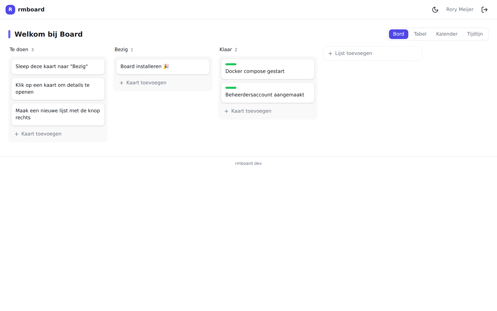
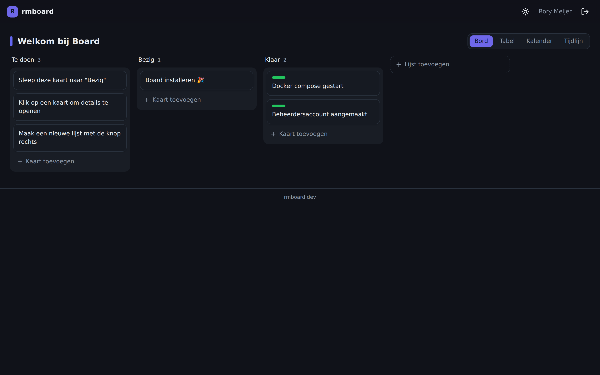

# rmboard

**rmboard** is een self-hosted, modern Kanban- en werkbeheerplatform — een privacy-vriendelijk
alternatief voor Trello/Linear dat volledig op je eigen server draait. Geen externe SaaS,
geen tracking, geen CDN's.

> Kernprincipe: `git clone` → `docker compose up -d` → je bestaande Caddy naar de app
> wijzen → domein openen → web-installer verschijnt → alleen een beheerdersaccount
> invullen → klaar. De database is standaard al geconfigureerd en raak je nooit aan.

## Screenshots

| Bord (licht) | Bord (donker) |
|---|---|
|  |  |

De weergavenaam (hier `rmboard`) volgt automatisch uit `APP_NAME`.

## Snel starten

```bash
git clone <deze-repo> rmboard
cd rmboard

cp .env.example .env
# Zet in .env je domein (APP_URL) en, als je Caddy in Docker draait, de naam
# van je Caddy-netwerk (CADDY_NETWORK). Meer hoef je in principe niet te doen.

docker compose up -d
```

`.env.example` is standaard ingesteld op een **Caddy die zelf in Docker draait**:
de stack koppelt zich automatisch aan je Caddy-netwerk en is daar bereikbaar
onder de naam **`rmboard`**. Voeg in je Caddyfile alleen nog toe:

```caddy
board.voorbeeld.nl {
    reverse_proxy rmboard:8080
}
```

Open daarna je domein. De **web-installer** verschijnt automatisch: vul een
beheerdersaccount in en je hebt meteen een werkend board met demo-inhoud.

De applicatie luistert op één platte HTTP-poort (standaard **8080**). Ze brengt
**geen** reverse proxy of TLS mee — dat regel je in je Caddy. Draait je Caddy
op de host in plaats van in Docker? Zie [scenario 1](#1-caddy-draait-op-de-host).

## Caddy-snippet

Reverb-websockets lopen via hetzelfde domein (pad `/app` en `/apps`), dus je
hoeft in beide gevallen geen tweede poort open te zetten.

### 1. Caddy draait zelf in Docker (standaard)

Dit is de standaardopstelling in `.env.example`. De stack koppelt zich
automatisch aan het netwerk van je Caddy (`CADDY_NETWORK`, standaard `caddy`)
en is daar bereikbaar onder de naam **`rmboard`** — geen host-poort nodig. Je
hoeft alleen de netwerknaam te kloppen te maken in `.env`:

```dotenv
CADDY_NETWORK=caddy      # naam van jouw bestaande Caddy-netwerk (docker network ls)
COMPOSE_FILE=docker-compose.yml:docker-compose.caddy.yml
```

Daarna volstaat `docker compose up -d`. In je Caddyfile:

```caddy
board.voorbeeld.nl {
    reverse_proxy rmboard:8080
}
```

### 2. Caddy draait op de host

Draait je Caddy direct op de host (buiten Docker)? Zet dan `CADDY_NETWORK` en
`COMPOSE_FILE` in `.env` in commentaar en verwijs naar de gepubliceerde poort:

```caddy
board.voorbeeld.nl {
    reverse_proxy localhost:8080
}
```

Caddy handelt TLS af; de app honoreert de `X-Forwarded-*`-headers en proxyt
websockets intern door naar Reverb. Wil je expliciet zijn over de websocket-
upgrade, dan mag ook (vervang `rmboard` door `localhost` bij een host-Caddy):

```caddy
board.voorbeeld.nl {
    @ws {
        header Connection *Upgrade*
        header Upgrade    websocket
    }
    reverse_proxy @ws  rmboard:8080
    reverse_proxy      rmboard:8080
}
```

## Wat zit er in de stack?

| Service         | Rol                                          | Naar host? |
|-----------------|----------------------------------------------|:----------:|
| `web` (nginx)   | Serveert de app op poort 8080                | ✅ 8080    |
| `app` (php-fpm) | Laravel 12 / PHP 8.4                         | —          |
| `postgres`      | PostgreSQL 17 (jsonb, GIN)                    | ❌ intern  |
| `valkey`        | Cache, sessions, queues (Redis-compatibel)   | ❌ intern  |
| `meilisearch`   | Full-text zoeken                             | ❌ intern  |
| `reverb`        | Websockets (realtime)                        | ❌ intern  |
| `queue-worker`  | Verwerkt de queue                            | —          |
| `scheduler`     | Draait geplande taken                        | —          |

`postgres` en `valkey` zijn bewust **niet** naar de host gemapt: ze zijn alleen
binnen het interne docker-netwerk bereikbaar.

## Configuratie

Alles is instelbaar via omgevingsvariabelen (zie [`.env.example`](.env.example)).
In de standaardopstelling geeft `docker-compose.yml` de juiste waarden al mee.
In de praktijk hoef je alleen `APP_URL` te zetten; optioneel SMTP en OIDC.

- **Naam** van je board (browsertitel + in de app) via `APP_NAME` (standaard `rmboard`).
- **Geheimen** (`APP_KEY`, `APP_SECRET`) worden bij de eerste start automatisch
  gegenereerd en op het storage-volume bewaard.
- **Registratie** staat standaard dicht (`REGISTRATION_OPEN=false`).
- **Max. uploadgrootte** via `MAX_UPLOAD_SIZE` (MB).

## Beheer vanaf de terminal

```bash
./update.sh     # bijwerken: dump → build → migrate → cache → health-check → rollback bij falen
./backup.sh     # pg_dump + storage naar ./backups (retentie: 7 dagelijks, 4 wekelijks)
./backup.sh --restore ./backups/daily/db-XXXX.sql.gz
./console.sh migrate    # snelkoppeling naar artisan in de container
```

## Health & versie

- `GET /api/health` rapporteert `installed`, de versie en de status van
  database/redis/meilisearch/reverb (200 zodra de database bereikbaar is).
- De versie komt uit de git tag (via het `VERSION`-bestand) en staat in de
  UI-footer en op `/api/health`.

## Ontwikkelen

```bash
composer install
npm install

php artisan migrate           # sqlite lokaal, of wijs naar je eigen postgres
npm run dev                   # Vite dev server
```

Kwaliteitscontroles (draaien ook in CI):

```bash
vendor/bin/phpstan analyse    # statische analyse, level 8
vendor/bin/pest               # tests
vendor/bin/pint --test        # code style
npm run lint                  # ESLint
npm run build                 # TypeScript + Vite build
```

## Documentatie

Uitgebreide handleidingen staan in [`docs/`](docs/):

- [Installatie](docs/installatie.md)
- [Bijwerken](docs/bijwerken.md)
- [Back-up & herstel](docs/backup.md)
- [Productie: beveiliging, monitoring & performance](docs/productie.md)
- [Licenties (los systeem in `license-server/`)](docs/licenties.md)

## Fasering

rmboard wordt in fases gebouwd; zie [`docs/PROJECT_BRIEF.md`](docs/PROJECT_BRIEF.md)
en [`CHANGELOG.md`](CHANGELOG.md) voor de status.

## Licentie

MIT.
